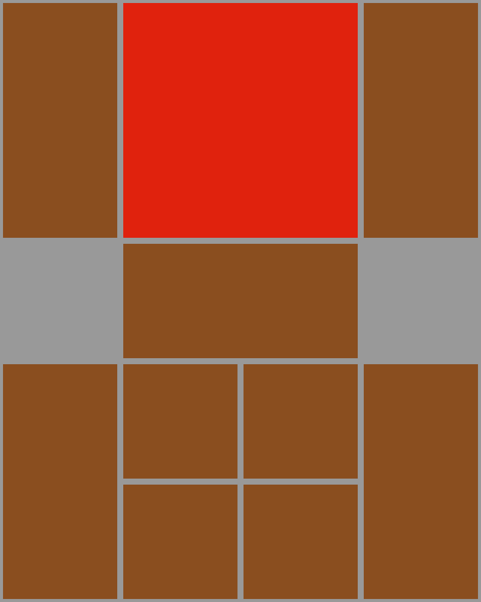

# klotski-sliding-puzzle-solver

Solves the Klotski puzzle using brute force width first tree transversal algorithm. This finds the solution with the least amount of steps.

The pieces in the puzzle can slide left/right/up/down. The grey areas are empty. The goal is to get the red piece all the way down and in the middle.

Watch the video solution: https://www.youtube.com/watch?v=nBwlvCKkSmE

